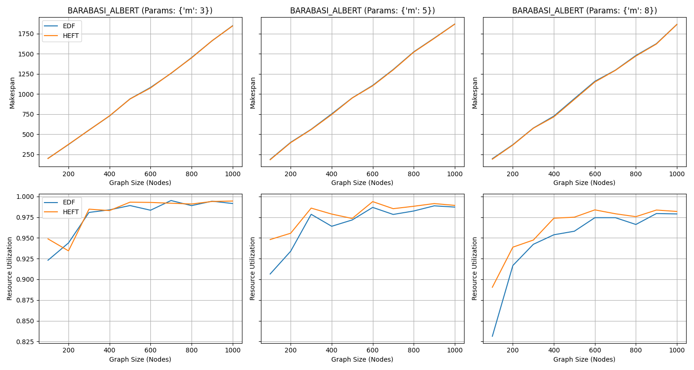
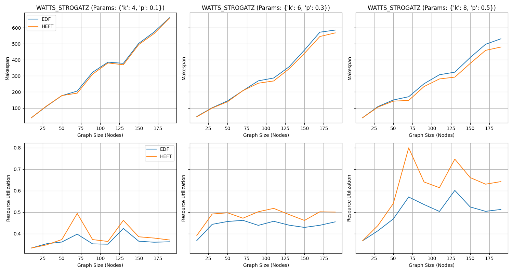
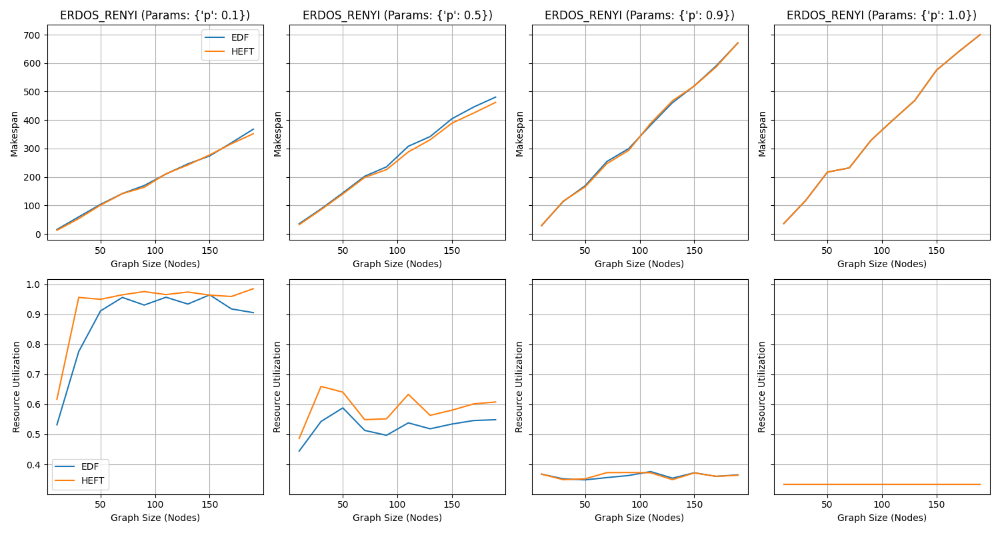
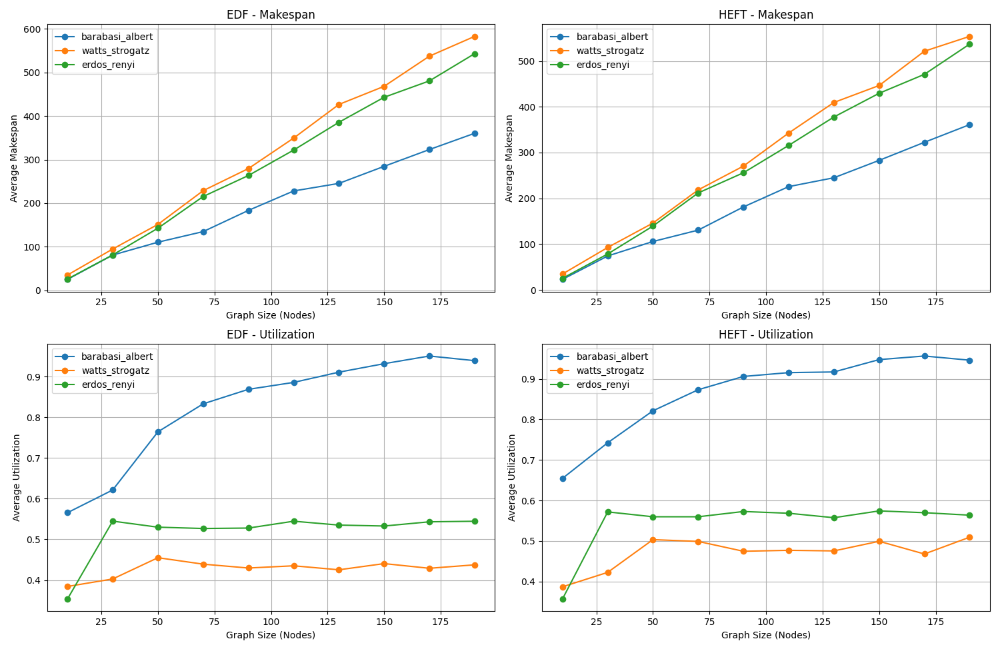
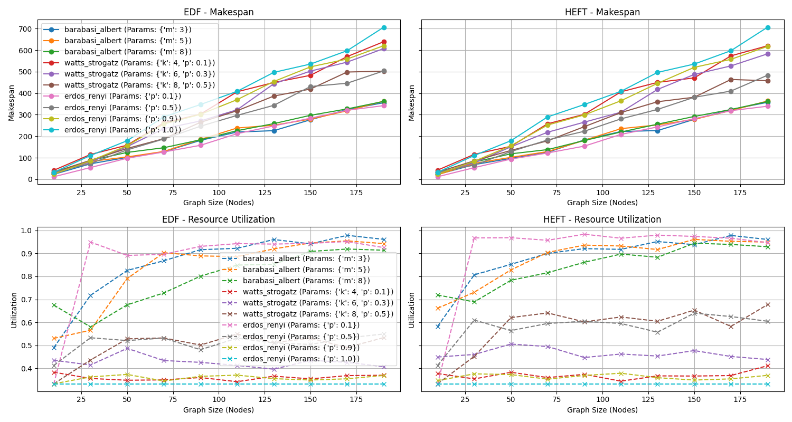

# DAG it Right!

### The `Real-Time Systems` course project

Sharif University of Technology - Fall 2024

---

+ **Mehrad Milanloo**

    + **Student ID**: 99105775

    + **Email**: milanloomehrad@gmail.com

+ **Hossein Alihosseini**

    + **Student ID**: 99101921

    + **Email**: themmdhossein@gmail.com

---

## Description

This project focuses on benchmarking task scheduling algorithms on Directed Acyclic Graphs (`DAG`s) in the context of complex network systems. The goal is to systematically evaluate the performance of scheduling algorithms, such as the Heterogeneous Earliest Finish Time (`HEFT`) algorithm, across synthetic and real-world DAGs. These benchmarks aim to analyze how various DAG structures and properties affect scheduling efficiency, specifically in terms of Makespan (total execution time) and resource utilization.

Key aspects of the project include:

+ Synthetic DAG Generation: Using graph generators such as **Barabási-Albert** (scale-free), **Watts-Strogatz** (small-world), and **Erdős-Rényi** (random) models to create controlled test cases.

+ Real-World DAGs: Modifying and preprocessing datasets from complex networks to convert them into realistic DAGs for scheduling experiments.

+ Task Scheduling Analysis: Simulating scheduling algorithms on DAGs and comparing performance metrics to identify strengths, weaknesses, and areas for optimization.

This project provides a command-line interface (`CLI`) to work with DAGs for scheduling benchmarks. The CLI supports:

+ Generating synthetic graphs with various network models.

+ Downloading and batch-processing scalable, real-world datasets.

+ Benchmarking and visualizing scheduling algorithms on DAGs.

## Installation

1. Clone the repository:

```bash
git clone https://github.com/MehradMilan/DAG-it-Right
cd DAG-it-Right
```

2. Install dependencies:

```bash
pip install -r requirements.txt
```

## How to Use the CLI

The CLI supports several commands. Below is a detailed explanation of each command:

### **1. Generate Synthetic Graphs**

You can generate synthetic graphs with arbitrary sizes and different models of complex networks.

**Supported Models and Parameters**:

1. **Barabási-Albert (Scale-Free Model)**

   + **Description**:
   
     - This model generates a scale-free network where some nodes have significantly higher connectivity than others.
   
     - It simulates real-world networks like the internet or social networks, where "hub" nodes are prevalent.

   + **Parameters**:
    
     - `m`: The number of edges added to the network for each new node.
    
       - Example values: `m = 3` (each new node connects to 3 existing nodes).
    
       - Larger values create denser networks with more connections.
    
       - Uses `m` to control the number of edges per new node, leading to hub-like structures.

   + **How It Works**:
    
     - Starts with a small, fully connected network of `m` nodes.
    
     - New nodes are added one at a time and connected to `m` existing nodes with probabilities proportional to their current degree (number of connections).

2. **Watts-Strogatz (Small-World Model)**

   + **Description**:
    
     - This model creates graphs with high clustering (nodes form tightly-knit groups) and short path lengths.
     
     - It models networks like neural connections or social relationships in communities.

   + **Parameters**:

     - `k`: Each node connects to `k` nearest neighbors in a ring topology.

       - Example values: `k = 4` (each node connects to its 4 nearest neighbors).

       - Larger values create graphs with higher density.

     - `p`: The probability of rewiring edges to introduce randomness.

       - Example values: `p = 0.1, 0.3, 0.5`.

       - Small `p` values result in highly structured graphs, while larger `p` values make the graph more random.
       
       - Uses `k` and `p` to balance clustering and randomness.

   + **How It Works**:
     
     - Starts with a regular ring lattice where each node connects to `k` neighbors.
     
     - Randomly rewires each edge with a probability `p` to introduce shortcuts, creating the "small-world" effect.

3. **Erdős-Rényi (Random Model)**

   + **Description**:
     
     - This model generates random graphs where edges are created independently with a fixed probability.
     
     - It is useful for studying random processes and testing network algorithms.

   + **Parameters**:
     
     - `p`: The probability of edge creation between any two nodes.
     
       - Example values: `p = 0.1, 0.5, 0.9`.
     
       - Small `p` values produce sparse graphs, while `p = 1.0` creates a complete graph.
     
       - Uses `p` to control the edge density, ranging from sparse to complete graphs.

   + **How It Works**:
     
     - Starts with a set of `n` nodes.
     
     - For each pair of nodes, adds an edge with probability `p`.

**Command**

```bash
python cli.py generate --graph-type <model> --nodes <num_nodes> 
--params <model_params> --output <output_file> 
[--visualize] [--benchmark] [--num-proc <num_processors>]
```

- **`--graph-type`**: Specifies the type of graph to generate (`barabasi_albert`, `watts_strogatz`, or `erdos_renyi`).

- **`--nodes`**: Number of nodes in the graph.

- **`--params`**: Model parameters in JSON format (e.g., `{"m": 3}` for Barabási-Albert).

- **`--output`**: The file path to save the generated graph in GML format.

- **`--visualize`**: Option to visualize the generated graph.

- **`--benchmark`**: Option to benchmark the graph with scheduling algorithms.

- **`--num-proc`**: Number of processors to use for benchmarking (default is 3).

**Examples**

+ **Generate a Barabási-Albert Graph**:

   - Creates a graph with 50 nodes where each new node connects to 5 existing nodes.

```bash
python cli.py generate --graph-type barabasi_albert --nodes 50 
--params '{"m": 5}' --output barabasi_albert_dag.gml
```

+ **Generate a Watts-Strogatz Graph**:

   - Creates a graph with 100 nodes, where each node connects to 6 nearest neighbors, and edges are rewired with a probability of 0.3.

```bash
python cli.py generate --graph-type watts_strogatz --nodes 100 
--params '{"k": 6, "p": 0.3}' --output watts_strogatz_dag.gml --visualize
```

+ **Generate and Benchmark an Erdős-Rényi Graph**:

   - Creates a graph with 75 nodes where each edge is created with a probability of 0.2, then benchmarks it with scheduling algorithms.

```bash
python cli.py generate --graph-type erdos_renyi --nodes 75 
--params '{"p": 0.2}' --output erdos_renyi_dag.gml --benchmark --num-proc 4
```

### 2. Download and Process Real-World Datasets

The CLI supports downloading real-world datasets (e.g., internet networks, autonomous systems, etc.) and processing them into DAGs.

**Command**:

1. Download Datasets:

```bash
python cli/cli.py download --type <dataset_type>
```

**Example**:

```bash
python cli/cli.py download --type internet_networks
```

1. Download Datasets:

```bash
python cli/cli.py download --type <dataset_type>
```

**Example**:

```bash
python cli/cli.py download --type internet_networks
```

2. Process a Single Dataset:

```bash
python cli/cli.py process --input <file_path> --format <file_format> 
--output <output_file>
```

**Example**:

```bash
python cli/cli.py process --input data/input/dataset/Oregon1_010526.txt 
--format edgelist --output p2p_gnutella_dag.gml
```

3. Batch-Process Datasets:

```bash
python cli/cli.py batch-process --type <dataset_type>
```

**Example**:

```bash
python cli/cli.py batch-process --type internet_networks
```

### 3. Benchmark and Visualize Scheduling

You can benchmark scheduling algorithms (like HEFT) on DAGs and visualize the results.

1. Benchmark a Single Network

**Command**:

```bash
python cli/cli.py benchmark --input <dag_file> --num-proc <num_processors> [--visualize]

```

**Examples**:

+ Benchmark a previously generated DAG with 3 processors:

```bash
python cli/cli.py benchmark --input barabasi_albert_dag.gml --num-proc 3
```

+ Benchmark and visualize the schedule:

```bash
python cli/cli.py benchmark --input p2p_gnutella_dag.gml --num-proc 4 --visualize
```

2. Batch-Benchmark:

Some pre-defined tests run on different models of complex networks with different scheduling algorithms and visualize the results.

**Command**:

```bash
python cli/cli.py batch-benchmark
```

## Results

## Results

This section provides a comprehensive analysis of the benchmarks performed on DAG scheduling algorithms across different network models and parameter configurations. The plots illustrate the behavior of two scheduling algorithms (HEFT and EDF) under various scenarios, focusing on makespan and resource utilization metrics.

### HEFT vs. EDF Performance

Across all plots, HEFT consistently outperforms EDF in both makespan and resource utilization. The difference is particularly noticeable in resource utilization, where HEFT achieves higher and more stable values, demonstrating its superior ability to balance workload across processors. The makespan for HEFT is also consistently lower than EDF, highlighting its efficiency in task scheduling, even as the network size grows.










### Average Behavior of Network Models

In the averaged plots, Barabási-Albert networks generally exhibit the best performance in terms of both makespan and resource utilization. The scale-free nature of Barabási-Albert graphs likely contributes to this efficiency, as hub nodes simplify task dependencies and reduce scheduling complexity. Erdos-Renyi networks show slightly inferior performance in terms of makespan compared to Barabási-Albert but maintain comparable utilization for certain parameter configurations. Watts-Strogatz networks, while having high clustering, pose challenges in interpretation due to their mixed performance, especially in resource utilization.




### Erdos-Renyi Observations

The Erdos-Renyi plots highlight the impact of the edge probability (`p`) on scheduling performance. When `p=0.1`, resource utilization peaks rapidly, suggesting that sparse graphs can effectively utilize resources under both scheduling algorithms. However, at `p=1` (complete graph), the utilization drops to zero, and both algorithms exhibit identical performance. This uniformity likely occurs because all tasks are interdependent in a complete graph, leaving no room for optimization by either algorithm.


### Detailed Analysis of Barabási-Albert and Watts-Strogatz

For Barabási-Albert graphs, the parameter `m` significantly influences the results. Larger values of `m` create denser networks, which increase makespan but slightly improve utilization due to higher connectivity among tasks. In contrast, Watts-Strogatz networks display more variability in both makespan and utilization, likely due to the combination of high clustering and randomness introduced by the rewiring probability `p`. The interpretation of Watts-Strogatz performance requires careful consideration of the balance between clustering and path length.

### General Trends and Insights

In all network models, makespan grows almost linearly with the graph size, reflecting the increased computational demand as more tasks are added. Resource utilization, however, demonstrates a non-linear pattern, heavily influenced by the network topology and parameters. Sparse networks like Erdos-Renyi with `p=0.1` and Barabási-Albert with lower `m` consistently perform better across both metrics, indicating their suitability for task scheduling scenarios. Watts-Strogatz networks, while realistic for certain applications, require careful parameter tuning to achieve optimal performance.




### Conclusion

These results provide valuable insights into the interplay between network topology and DAG scheduling algorithm performance. HEFT emerges as the superior algorithm across all scenarios, particularly in resource utilization. Among the network models, Barabási-Albert demonstrates the most favorable characteristics for task scheduling, followed by Erdos-Renyi with low edge probabilities. This analysis highlights the importance of selecting appropriate network models and parameters when benchmarking scheduling algorithms.

## Dataset Sources

The real-world datasets are downloaded from:

+ [SNAP](https://snap.stanford.edu/data/)